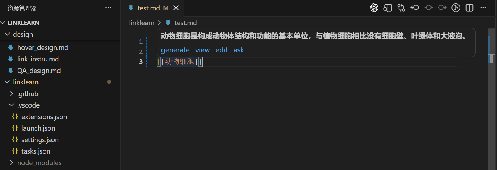
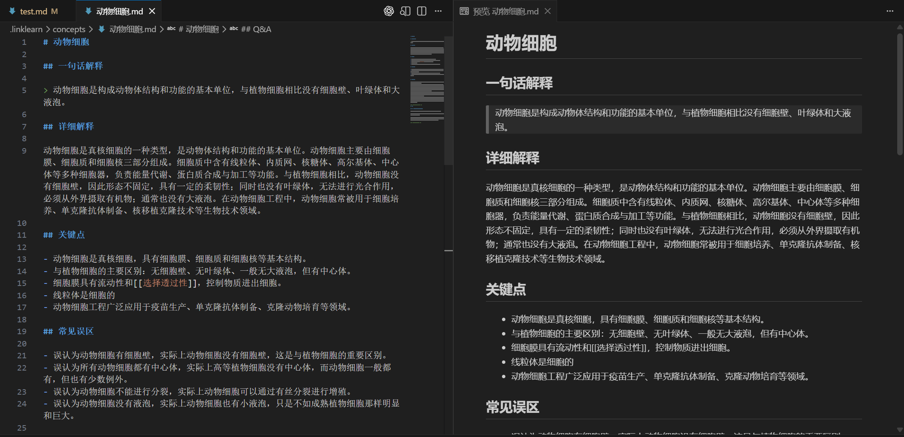
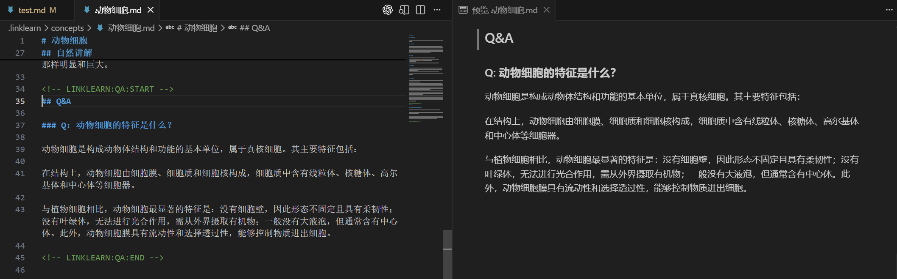

# LinkLearn

一个面向 Markdown / MDX 的 VS Code 扩展：在文档中识别 `[[术语]]`，并把术语解释存储在到工作区内的 `.linklearn/concepts/*.md`；可针对术语追加提问，递推式进行，目标形成mindmap

---

## 环境要求（必要软件）

- **VS Code**：`>= 1.109.0`
- **Node.js**：建议 `>= 20`
- **npm**：建议 `>= 10`

---

## 安装与启动（开发模式）

1. 安装依赖
   ```bash
   npm install
   ```
2. 编译扩展
   ```bash
   npm run compile
   ```
3. 在 VS Code 中按 `F5` 启动 Extension Development Host 进行调试。

---

## API 配置流程（OpenAI-compatible）

### 方式 A：命令面板配置（推荐）

1. 打开命令面板（`Cmd/Ctrl + Shift + P`）。
2. 执行 `LinkLearn: Set API Key`。
3. 输入你的 API Key（会写入 VS Code User Settings）。

### 方式 B：手动在 Settings 中配置

在 VS Code Settings（User 或 Workspace）中设置以下字段：

- `linklearn.ai.provider`: `openai` | `mock`
- `linklearn.ai.baseUrl`: 例如 `https://api.openai.com/v1`
- `linklearn.ai.apiKey`: 你的 API key
- `linklearn.ai.model`: 例如 `gpt-4o-mini`
- `linklearn.ai.timeoutMs`: 请求超时（毫秒）
- `linklearn.ai.maxRetries`: 失败重试次数
- `linklearn.ai.debug`: 是否输出调试日志

### 最小可用配置示例

```json
{
  "linklearn.ai.provider": "openai",
  "linklearn.ai.baseUrl": "https://api.openai.com/v1",
  "linklearn.ai.apiKey": "<YOUR_API_KEY>",
  "linklearn.ai.model": "gpt-4o-mini"
}
```

---

## 当前实现状态

### ✅ 已实现

#### 1) Hover + 术语操作流（核心）
- 在 `markdown` 文件中识别 `[[term]]` 并提供 Hover。
- Hover 可展示“一句话解释”（若 concept 文件里已有）。
- Hover 内已接入 4 个操作：
  - `generate`（AI 生成概念）
  - `view`（打开 concept 文件）
  - `edit`（编辑一句话解释）
  - `ask`（对概念提问并写入 Q&A）

#### 2) Concept 文件存储与自动创建
- concept 文件目录：`<workspace>/.linklearn/concepts/<term>.md`。
- 自动创建目录与 concept 文件模板。
- 对 concept 文件建立 watcher，文件变更时失效缓存，避免 Hover 读旧值。

#### 3) 命令能力（已注册并可用）
- `linklearn.openConcept`
- `linklearn.editExplanation`
- `linklearn.generateConcept`
- `linklearn.askConcept`
- `linklearn.setApiKey`

#### 4) AI 生成功能（OpenAI-compatible）
- 支持通过配置读取：`baseUrl / apiKey / model / timeout / retries / debug`。
- `generateConcept`：强约束 JSON 输出 + 解析与校验（含重试）。
- `answerConceptQuestion`：基于术语 + 已有概念内容回答问题。
- `renderConceptNarrative`：支持模板讲解与 AI 讲解两种自然叙事模式。

#### 5) 多语言输出
- 支持输出语言模式：`zh / en / bilingual`。
- 生成 markdown 时根据语言模式渲染中英小节与 narrative。

#### 6) 开发期 Mock Provider
- `linklearn.ai.provider = mock` 时可走本地 mock 数据，不依赖真实 API。

---

## 使用效果








---

## 快速使用

1. 在 markdown 中输入 `[[卷积]]` 这类术语。
2. Hover 到术语上，点击：
   - `generate`：自动生成概念文档
   - `view`：打开概念文档
   - `edit`：手动改一句话解释
   - `ask`：向概念提问并写入 Q&A
3. 首次使用 openai provider 时，执行 `LinkLearn: Set API Key`。

---

## 下一步（Roadmap）

- [ ] 为命令与 hover 增加端到端测试（当前仅有基础测试脚手架）。
- [ ] 增加错误场景引导（例如模型不可用、配额不足时的更细分 UX）。
